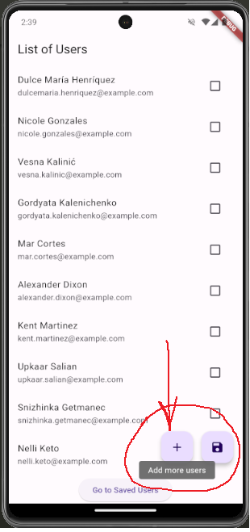
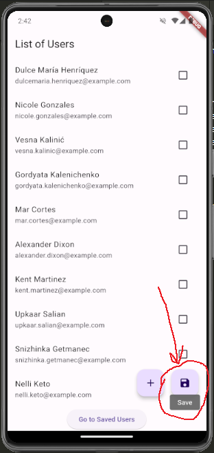
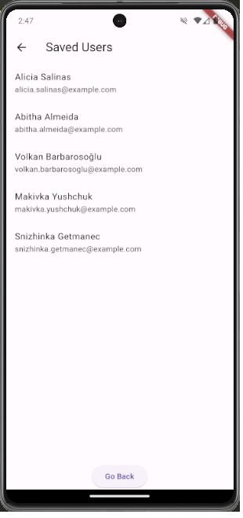

# hw4

HW4 by

Firdavsbek Ismoilov,    JSE1,    2110081.

## Getting Started

Run pub get to install dependencies:

```bash
flutter pub get
```

Run the main.dart file to run the app.

## Project Structure

- main.dart: main file of the project.
- db_helper.dart: database helper class which contains all the methods to interact with the database.
- models.dart: contains the model classes for the database tables.
- screen2.dart: the second screen which contains the list of users from <https://randomuser.me/api/> api.
- screen3.dart: the third screen which contains the list of users from the database.

## Screenshots

- The first button – fetches more users from the API and adds them to the end of the list:


    The 'Add more users' text is achieved by using Tooltip widget.

- The second button – saves the selected users to the database, and then navigates to the third screen:


    The 'Save' text is achieved by using Tooltip widget.

- The third screen – shows the list of users from the database:


## Informational

Warning! It might take some time to load the users from the API.
